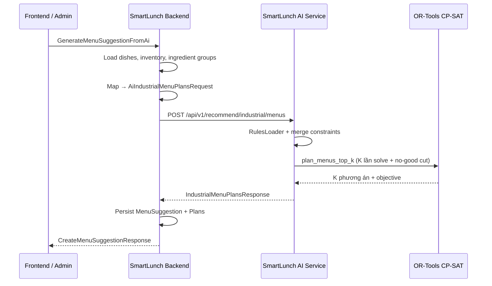

# LOGIC AI — Industrial Planner (Menus + Ingredient Prep)

Tài liệu mô tả **nghiệp vụ**, **cách hoạt động** và **nội dung khóa luận** (phân tích/lựa chọn/thiết kế/đánh giá) cho hai chức năng AI trong `SmartLunch-AI-Service`:

| # | Chức năng | Endpoint | Engine |
|---|-----------|----------|--------|
| 1 | **Gợi ý thực đơn (top-K)** | `POST /api/v1/recommend/industrial/menus` | `IndustrialPlannerService.plan_menus_top_k` |
| 2 | **Gợi ý chuẩn bị nguyên liệu theo đơn hàng** | `POST /api/v1/recommend/industrial/ingredients/prepare` | `IngredientPrepPlannerService.plan` |

Cả hai dùng **Google OR-Tools CP-SAT**. Chi tiết schema JSON xem thêm `INDUSTRIAL_PLANNER.md`.

### Mục lục

**Phần A — Tài liệu kỹ thuật (triển khai)**

| Mục | Nội dung |
|-----|----------|
| §1–§10 | Gợi ý thực đơn: nghiệp vụ, API, engine, rules, lỗi |
| §11 | Gợi ý chuẩn bị nguyên liệu: API, engine, backend, lỗi |

**Phần B — Nội dung khóa luận**

| Mục khóa luận | Chức năng |
|---------------|-----------|
| §2.5, §3.4, §5.3 | Gợi ý thực đơn |
| §2.6, §3.5, §5.4 | Gợi ý chuẩn bị nguyên liệu |
| §12 | So sánh hai chức năng AI |

---

## 1. Mục đích nghiệp vụ

### Bài toán

Bếp công nghiệp / căn tin KCN cần **gợi ý thực đơn** cho một khoảng ngày (thường 7 ngày), mỗi ngày đủ các **slot bữa** (`meal_structure`: món chính, phụ, canh, tráng miệng…), sao cho:

- Trong **ngân sách** mỗi suất (`budget_per_serving`)
- **Đa dạng** protein, cách chế biến, không lặp nguyên liệu chính liên tiếp
- **Tận dụng kho** nguyên liệu sẵn có (`available_ingredients`)
- Hỗ trợ món **multi-cover** (phở/mì/bánh canh cover cùng lúc `main` + `side` + `soup`)

### Khác với endpoint tuần đầy đủ

| | `POST .../industrial/menus` | `POST .../industrial/week` |
|---|---|---|
| **Đầu ra** | Top-K **phương án thực đơn** + điểm | 1 thực đơn + **shopping list** + **ước tính chi phí tuần** |
| **`servings_per_day`** | Không dùng | Bắt buộc (tính kg mua) |
| **Mô hình CP-SAT** | Biến `y[d,i]` — chọn **món/ngày**, món có thể cover nhiều slot | Biến `x[d,s,i]` — chọn **món/slot/ngày** |
| **Top-K** | Mặc định 3, tối đa 10 | Mặc định 1, tối đa 3 |

Endpoint **menus** phục vụ bước **“chọn phương án thực đơn”** trên UI; Backend lưu vào `MenuSuggestion` / `MenuSuggestionPlan` để bếp trưởng so sánh và chốt.

---

## 2. Vị trí trong hệ thống



**Luồng Backend** (`GenerateMenuSuggestionFromAiCommandHandler`):

1. Lấy món theo `DishIds`, kiểm tra slot junction (`dish_dish_categories`), cooking method.
2. Đảm bảo mỗi slot trong `meal_structure` có ít nhất một món trong pool.
3. Tính `popularity` (28 ngày), map inventory → `available_ingredients` (tên **English**).
4. Gom `ingredient_groups` từ DB (category → danh sách `NameEnglish`).
5. Gọi `IAiMenuPlannerClient.RecommendIndustrialMenusAsync` → endpoint này.
6. Lưu `plans[]` (rank, plan_score, objective_value, week_menu từng ngày/slot).

**Quy ước dữ liệu quan trọng:** `main_ingredient`, `available_ingredients`, `ingredient_groups` dùng **NameEnglish** từ DB để khớp ràng buộc nhóm protein/cá (`protein`, `seafood` trong `rules.json`).

---

## 3. API — Request & Response

### Request (`IndustrialMenuPlansRequest`)

| Trường | Mặc định | Ý nghĩa nghiệp vụ |
|--------|----------|-------------------|
| `days` | Thứ 2 → Chủ nhật | Danh sách ngày cần lên thực đơn (có thể < 7) |
| `meal_structure` | main, side, soup, dessert | Slot bắt buộc **mỗi ngày** |
| `dishes` | (bắt buộc) | Pool món; mỗi món có `category`, `covers_categories`, `main_ingredient`, `cost_per_serving`, … |
| `available_ingredients` | `[]` | Kho hiện có → cộng điểm món dùng được NL chính |
| `budget_per_serving` | 25_000 VND | Tổng chi phí **các món được chọn trong ngày** ≤ budget |
| `constraints` | `null` → lấy từ `rules.json` | Ràng buộc cứng/mềm (merge với profile) |
| `rules_key` | `"industrial"` | Profile trong `app/core/rules.json` |
| `ingredient_groups` | `{}` | Ghi đè/bổ sung nhóm NL từ Backend |
| `top_k` | 3 (max 10) | Số phương án trả về |
| `time_limit_seconds` | 5.0 | Timeout mỗi lần gọi solver |

### Response (`IndustrialMenuPlansResponse`)

```json
{
  "plans": [
    {
      "rank": 1,
      "plan_score": 0.612,
      "objective_value": 842000.0,
      "week_menu": [
        {
          "day": "Thứ 2",
          "day_cost_per_serving": 24500,
          "dishes": [
            {
              "name": "Phở bò",
              "category": "main",
              "score": 0.71,
              "reasons": ["Món phổ biến", "Điểm phù hợp cao", "..."],
              "cost_per_serving": 22000
            }
          ]
        }
      ]
    }
  ]
}
```

- **`objective_value`:** Giá trị hàm mục tiêu CP-SAT (so sánh **tương đối** giữa các phương án).
- **`plan_score`:** Trung bình `score` các món trong `week_menu` (0–1), dùng hiển thị UX.
- **`rank`:** Sắp sau khi sort theo `objective_value` rồi `plan_score` (cao → tốt).

**Không có:** `shopping_list`, `cost_estimate` (chỉ có `day_cost_per_serving` từng ngày).

---

## 4. Luồng xử lý trong endpoint (từng bước)

File: `app/api/v1/endpoints/industrial.py` — `recommend_industrial_menus`.

```
Request JSON
    │
    ▼
① RulesLoader().load_profile(req.rules_key)
    │  Đọc rules.json mỗi request (sửa file không cần redeploy)
    │
    ▼
② available_ingredients = { name.lower(): quantity_kg }
    │
    ▼
③ effective_constraints = _merge_constraints(req.constraints, profile.constraints)
    │  Base = constraints từ profile; request chỉ ghi đè field đã set (≠ null)
    │
    ▼
④ planner.plan_menus_top_k(...)
    │
    ▼
⑤ return IndustrialMenuPlansResponse  (hoặc HTTP 500 nếu exception)
```

### `_merge_constraints`

- Nếu request **không** gửi `constraints` → dùng hoàn toàn profile (`rules_key`, ví dụ `industrial`).
- Nếu có gửi → `model_dump(exclude_unset=True)` merge lên base; giá trị `null` không ghi đè.

---

## 5. Engine — `plan_menus_top_k` (chi tiết)

File: `app/services/industrial_planner_service.py`.

### 5.1. Chuẩn bị

1. **Scoring config** từ `rules_profile.scoring` (ví dụ profile `industrial`: `budget_fit_weight`, `repeat_main_dish_penalty`, …).
2. **`kw_sets`:** Nhóm từ khóa nguyên liệu = `rules.json` ∪ `request.ingredient_groups` (key lowercase).
3. **`dishes_by_cat`:** Index món theo **mọi slot** trong `_dish_covers(dish)` (`category` + `covers_categories`).  
   - Phở: `covers_categories = [main, side, soup]` → một món nằm trong pool của 3 slot.
4. **Validate pool:** Mỗi `slot` trong `meal_structure` phải có ≥ 1 món → nếu thiếu → `plans: []`.
5. **`base_scores[i]`** ∈ [0,1] cho từng món:
   - `base_score` + fit ngân sách + popularity/5 + bonus NL có trong kho + trọng số `tags`.

### 5.2. Mô hình CP-SAT (`_solve_cpsat_top_k`)

**Biến quyết định:** `y[d, i] ∈ {0,1}` — món `i` có được chọn vào ngày `d` hay không.

**Ràng buộc cứng (hard):**

| Ràng buộc | Mô tả |
|-----------|--------|
| Coverage mỗi slot/ngày | Với mỗi `(d, cat)` trong `meal_structure`: đúng **một** món được chọn sao cho `cat ∈ covers(dish)` |
| `max_per_week` | Tổng số ngày món `i` xuất hiện ≤ `dish.max_per_week` |
| `group_frequencies` | Min/max số ngày dùng NL thuộc nhóm (`protein`, `seafood`, …) qua `kw_sets` |
| Legacy | Nếu `group_frequencies` rỗng: map `max_same_protein_per_week` → protein max; `min_fish_per_week` → seafood min |
| Không lặp NL chính 2 ngày liên tiếp | Trên món cover slot `main` / `noodle_soup` |
| Xen kẽ cách chế biến | Không cùng `cooking_method` hai ngày liên tiếp (slot chính) |
| `max_consecutive_same_main_dish` | Cùng một món cover `main` không quá N ngày liên tiếp (cửa sổ N+1) |
| Budget/ngày | Σ `cost_per_serving` các món chọn trong ngày ≤ `budget_per_serving` |

**Hàm mục tiêu (soft, maximize):**

- Điểm cơ bản × hệ số (món cover nhiều slot được nhân `cover_count`).
- **Reuse NL:** bonus nếu cùng `main_ingredient` trong 2–3 ngày gần (`prefer_ingredient_reuse`).
- **Penalty:** lặp cùng món cover `main` hai ngày liên tiếp (`repeat_main_dish_penalty` từ scoring).

### 5.3. Sinh Top-K

Vòng lặp `plan_idx = 0 .. top_k-1`:

1. `solver.Solve(model)` với `random_seed = 10007 + plan_idx * 9973` (đa dạng hóa phương án).
2. Trích `chosen_by_day[d][cat] = dish_index` từ các `y[d,i]=1`.
3. **No-good cut:** cấm chọn **đúng cùng tập** `(d,i)` đã chọn: `sum(picked_literals) ≤ len - 1`.
4. Solve lại → phương án khác (nếu còn feasible).

Kết quả sort theo `objective_value` giảm dần → gán `rank` 1..K.

### 5.4. Dựng response menu

`_build_week_menu_multi_cover`:

- Với mỗi ngày, duyệt `meal_structure` theo thứ tự slot.
- Mỗi slot lấy món đã chọn **cover** slot đó (cùng món có thể hiện ở nhiều slot — ví dụ phở vừa main vừa soup).
- `day_cost_per_serving` = tổng `cost_per_serving` của **các món distinct** được chọn trong ngày (không cộng trùng nếu một món cover nhiều slot — tính theo `picked` set).
- `reasons`: phổ biến, điểm cao, cách chế biến, NL chính.

`plan_score` = trung bình `dish.score` trên toàn bộ món trong tuần (cap 1.0).

---

## 6. Ví dụ nghiệp vụ — Cơm vs Phở

### Cơm truyền thống

`meal_structure = [main, side, soup, dessert]`

- Mỗi slot một món riêng (4 món/ngày).
- Ràng buộc protein/cá áp trên món cover `main`.

### Phở / mì / bánh canh

Món đăng ký:

```json
{
  "category": "main",
  "covers_categories": ["main", "side", "soup"]
}
```

- Solver có thể chọn **1 món** cho 3 slot; chỉ cần thêm `dessert` (và có thể món phụ khác nếu cấu trúc bữa yêu cầu).
- Endpoint **week** (mô hình `x[d,s,i]`) **không** hỗ trợ multi-cover đầy đủ → dùng **menus** cho kịch bản này.

---

## 7. Cấu hình `rules.json` (profile `industrial`)

Đường dẫn: `app/core/rules.json`.

**Scoring mặc định (industrial):**

- `base_score`, `budget_fit_weight`, `popularity_weight`
- `available_ingredient_bonus`, `ingredient_reuse_bonus`, `repeat_main_dish_penalty`
- `tag_weights`: traditional, comfort, healthy, budget

**Constraints mặc định:**

```json
"group_frequencies": [
  { "group_name": "protein", "max_count": 3 },
  { "group_name": "seafood", "min_count": 2 }
],
"no_repeat_main_ingredient_consecutive_days": true,
"alternate_cooking_methods": true,
"prefer_ingredient_reuse": true,
"max_consecutive_same_main_dish": 3
```

Backend có thể gửi `rules_key` khác (`org_company`, `org_elementary`, …) — merge scoring/constraints tương ứng.

**`ingredient_groups`:** Định nghĩa tập từ khóa cho `protein`, `seafood`, … Backend truyền thêm qua `ingredient_groups` để đồng bộ master data DB.

---

## 8. Lỗi, edge case, giới hạn

| Tình huống | Hành vi |
|------------|---------|
| Thiếu món cho một slot | `plans: []` (200 OK, rỗng) |
| CP-SAT infeasible / timeout | Dừng sớm vòng Top-K; có thể `< top_k` phương án |
| Exception bất kỳ | HTTP **500**, `detail: "Industrial menus (top-k) failed: ..."` |
| Pool chỉ có món `category=main` nhưng junction có `covers_categories` soup/side | **Bắt buộc** index theo `covers_categories` — Backend phải gửi đủ slot từ junction |
| `top_k` lớn + nhiều ngày | Thời gian ≈ `top_k × time_limit_seconds` (mỗi lần solve) |

**Khuyến nghị vận hành:**

- `time_limit_seconds`: 5–15s cho tuần 7 ngày; tăng nếu pool món lớn.
- Đảm bảo nhóm `seafood` / `protein` trong `ingredient_groups` khớp `main_ingredient` English, nếu không ràng buộc min/max cá/protein **bị bỏ qua** (không có keyword match).

---

## 9. So sánh nhanh hai endpoint industrial

```
industrial/menus          industrial/week
─────────────────         ─────────────────
Top-K plans               1 plan (+ shopping)
Multi-cover CP-SAT        Per-slot CP-SAT
Không servings_per_day    Cần servings_per_day
UI: chọn phương án        UI: báo cáo mua + chi phí
Backend: MenuSuggestion   (có thể dùng trực tiếp hoặc bước sau)
```

---

## 10. File liên quan

| Vai trò | Đường dẫn |
|---------|-----------|
| Endpoint (cả hai chức năng) | `app/api/v1/endpoints/industrial.py` |
| Schema | `app/schemas/industrial.py` |
| Planner thực đơn | `app/services/industrial_planner_service.py` |
| Planner nguyên liệu | `app/services/ingredient_prep_planner_service.py` |
| Rules (chỉ thực đơn) | `app/core/rules_loader.py`, `app/core/rules.json` |
| Backend — gợi ý thực đơn | `Commands/MenuSuggestions/GenerateMenuSuggestionFromAi/` |
| Backend — gợi ý nguyên liệu | `Commands/IngredientIntake/GenerateIngredientPrepFromAi/` |
| API Controller nguyên liệu | `Controllers/v1/IngredientIntakeProposalController.cs` |
| HTTP client | `Infrastructure/ExternalServices/AiMenuPlannerClient.cs` |
| Seed đơn thử nghiệm AI | `Infrastructure/Data/Scripts/04_seed_data/21_seed_bulk_upcoming_orders_for_ai.sql` |

---

## 11. Gợi ý lượng nguyên liệu cần chuẩn bị theo đơn hàng sắp tới (CP-SAT)

### 11.1. Mục đích nghiệp vụ

Khi hệ thống đã có **đơn hàng sắp tới** (bảng `orders`, `order_items`), bếp cần biết:

- Tổng **nhu cầu nguyên liệu theo từng ngày** (dựa trên BOM/định mức `dish_ingredients`)
- Kế hoạch **mua/chuẩn bị mỗi ngày** để vừa đủ dùng, có tồn an toàn, và tránh mua dồn một ngày (dao động lớn)

Endpoint này giải bài toán “procurement planning” ở mức **nguyên liệu**, tách biệt với bài toán “menu planning”.

### 11.2. Mapping DB → dữ liệu đầu vào AI

Các bảng liên quan (BE):  
`dish_values`, `contracts`, `contract_excluded_dates`, `ingredient_categories`, `ingredients`, `dishes`, `dish_dish_categories`, `dish_ingredients`, `orders`, `order_items`.

Quy ước chính để tính demand:

- **Đơn hàng theo ngày**: `orders.ScheduledDate` và/hoặc `order_items.ServiceDate` (đơn tuần/hợp đồng) quyết định `service_date`.
- **Số suất**: `order_items.Quantity` là số suất món `DishId` trong ngày `service_date`.
- **BOM/định mức**: `dish_ingredients.Quantity` theo `(DishId, IngredientId, DishValueId)` ⇒ cần chọn đúng `DishValueId` theo hợp đồng/đơn.
  - `contracts.DishValueId`: mức giá suất ăn/định mức tương ứng hợp đồng.
  - Nếu đơn lẻ không gắn hợp đồng, BE cần quy ước `DishValueId` mặc định.
- **Tên nguyên liệu**: khuyến nghị dùng `ingredients.NameEnglish` (ổn định cho AI), fallback `ingredients.Name`.

Vì `SmartLunch-AI-Service` không truy cập DB trực tiếp, **Backend** sẽ gom và gửi:

- `order_items[]`: (service_date, dish_id, quantity_meals)
- `dish_boms[]`: (dish_id, ingredients[] {ingredient_name, quantity_kg_per_meal, cost_per_kg?})
- `available_ingredients[]`: tồn kho hiện có (kg)

### 11.3. API

- **Route:** `POST /api/v1/recommend/industrial/ingredients/prepare`
- **Request:** `IndustrialIngredientPrepRequest` (`app/schemas/industrial.py`)
  - `start_date` (YYYY-MM-DD)
  - `days` (planning horizon, mặc định 7)
  - `order_items[]` (đơn sắp tới)
  - `dish_boms[]` (BOM theo kg/suất)
  - `available_ingredients[]` (tồn kho)
  - `constraints`:
    - `lead_time_days`: lead time mua → dùng
    - `safety_stock_kg`: tồn an toàn cuối ngày
    - `max_inventory_kg`: giới hạn tồn kho (optional)
    - `holding_weight`, `smooth_weight`: trọng số tối ưu

- **Response:** `IndustrialIngredientPrepResponse`
  - `summary_by_day[]`: tổng demand/mua/tồn cuối ngày cho toàn bộ nguyên liệu
  - `ingredients[]`: chi tiết từng nguyên liệu theo ngày

### 11.4. Luồng xử lý trong AI-Service

File: `app/api/v1/endpoints/industrial.py` → `recommend_ingredient_preparation`

1. Parse `start_date`, tạo list ngày trong horizon.
2. Tính **ingredient demand** theo ngày:
   - join `order_items` với `dish_boms[dish_id]`
   - demand(ingredient, day) = Σ quantity_meals × quantity_kg_per_meal
3. Chạy CP-SAT để đề xuất lượng mua và tồn kho:
   - biến `buy[ingredient, day]` (grams), `inv[ingredient, day]` (grams)
   - cân bằng tồn kho:
     - \(inv_d = inv_{d-1} + buy_d - demand_{d + lead}\)
   - ràng buộc:
     - \(inv_d ≥ safety\_stock\)
     - (optional) \(inv_d ≤ max\_inventory\)
4. Objective (minimize):
   - chi phí mua (nếu có `cost_per_kg`)
   - + phạt giữ tồn kho (holding)
   - + phạt dao động lượng mua giữa ngày (smoothness)
5. Trả kết quả theo kg (làm tròn 3 chữ số thập phân).

### 11.5. Ghi chú vận hành

- Nếu solver infeasible (do safety stock/max inventory quá chặt), service fallback sang chiến lược đơn giản: “mua đủ bù demand thiếu so với tồn hiện tại”.
- Đơn tuần/hợp đồng trong BE thường dùng `order_items.ServiceDate`; cần đảm bảo BE truyền đúng `service_date` cho AI.

