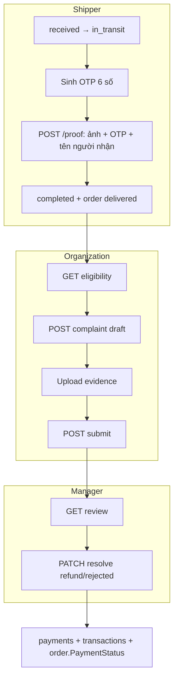

# Flow khiếu nại Organization — Tài liệu triển khai Backend

Tài liệu tổng hợp **Phase 1 → 3** cho nghiệp vụ: Organization khiếu nại sau giao hàng, Manager xử lý (hoàn tiền / từ chối), Shipper bằng chứng giao hàng + OTP người nhận.

**Phạm vi:** `SmartLunch-Backend-Service`  
**Cập nhật:** 2026-05-29

---

## 1. Tóm tắt nghiệp vụ (đã chốt)

| Chủ đề | Quyết định |
|--------|------------|
| **Thời hạn khiếu nại** | Chỉ khi đơn **`delivered` (đã giao)**. Được khiếu nại **trong vòng 24 giờ** kể từ lúc đơn chuyển sang trạng thái đã giao. **Sau 24 giờ → không** được tạo/gửi khiếu nại mới. |
| Số khiếu nại / đơn | Trong **cùng cửa sổ 24h** có thể gửi **nhiều** khiếu nại (mỗi sự cố một lần). Hết hạn thì **tất cả** khiếu nại mới đều bị chặn. |
| Hoàn tiền | Theo **số suất thiếu**; Manager có thể **chỉnh tay** `finalRefundAmount` |
| Đổi suất | **Không** có |
| File đính kèm | Ảnh ≤ 5MB; video ≤ 25MB (JPEG/PNG/WebP, MP4/MOV) |
| Người nhận (Shipper) | **Bắt buộc** tên + **OTP** khi upload proof |
| Manager quyết định | `refund` hoặc `rejected` (không `replace_meal`) |

**Mốc “đã giao” (bắt đầu đếm 24h):**

- `orders.status` phải là `delivered`.
- Thời điểm bắt đầu = `deliveries.delivered_at` khi giao hoàn tất (shipper `POST /proof`, hoặc manager đánh dấu đã giao — cùng thời điểm cập nhật trạng thái đơn).
- **Hết hạn** = thời điểm đó **+ 24 giờ** (`ComplaintDeadlineAt` trên từng khiếu nại / API eligibility).

**Kiểm tra backend:** `OrganizationComplaintRules.CanComplainAboutOrder` — dùng khi `GET .../eligibility`, `POST` tạo khiếu nại, và `POST .../submit`.

---

## 2. Kiến trúc tổng quan



---

## 3. Các Phase đã thực hiện

### Phase 1 — Nền tảng khiếu nại (CRUD + Manager)

**Mục tiêu:** Organization tạo/gửi khiếu nại; Manager xem và quyết định.

| Hạng mục | Chi tiết |
|----------|----------|
| DB | Mở rộng `complaints`; bảng `complaint_evidence`; mở rộng `deliveries` (người nhận) |
| Entity | `Complaint`, `ComplaintEvidence` |
| Rules | `OrganizationComplaintRules`, `ComplaintEvidenceValidator`, `ComplaintRefundCalculator` |
| API Organization | `OrganizationComplaintController` — eligibility, CRUD draft, evidence, submit |
| API Manager | `ComplaintController` — list, `GET {id}/review`, `PATCH {id}/resolve` |
| Shipper (cơ bản) | `POST .../proof` — ảnh, thời gian giao; bắt buộc tên + mã xác nhận |
| Hoàn tiền (ghi sổ) | `ComplaintRefundRecorder` → `payments` (refunded) + `transactions` (chi) + `complaints.RefundPaymentId` |

**Migration:** `62_organization_complaints.sql`, `63_complaint_refund_payment.sql`

---

### Phase 2 — OTP giao hàng + luồng Shipper chặt + thông báo in-app

**Mục tiêu:** Chống khiếu nại/khai báo sai; chuẩn hóa flow giao hàng theo `agent.md`.

| Hạng mục | Chi tiết |
|----------|----------|
| OTP | Khi shipper → `in_transit`: sinh OTP 6 số, HSD 48h (`deliveries.DeliveryOtp`) |
| Organization xem OTP | `GET /api/v1/organization/deliveries/orders/{orderId}/otp` |
| Validate proof | `RecipientConfirmationCode` phải **khớp** `DeliveryOtp` |
| Chặn PATCH completed | Không cho `PATCH .../status` → `completed`; chỉ qua `POST /proof` |
| Thông báo DB | `notifications` khi submit (→ Manager/Admin) và khi resolve (→ Organization) |
| Services | `DeliveryOtpService`, `ComplaintNotificationService`, `DeliveryNotificationService` |

**Migration:** `64_delivery_otp.sql`

**Luồng Shipper chuẩn:**

```
pending → received → in_transit (+ OTP) → POST /proof → completed
```

---

### Phase 3 — Email + API thông báo + cập nhật thanh toán đơn

**Mục tiêu:** Kênh email song song in-app; mobile đọc thông báo; đồng bộ trạng thái thanh toán sau hoàn tiền.

| Hạng mục | Chi tiết |
|----------|----------|
| Email khiếu nại | `ComplaintEmailService` — gửi Manager/Admin khi submit; gửi Organization khi resolve (SMTP qua `IEmailSender`, tôn trọng `Smtp:Enabled`) |
| Email OTP giao | `DeliveryEmailService` — gửi tới email user đặt đơn + `orders.RecipientEmail` |
| API thông báo | `NotificationController` — list, unread-count, mark read, read-all |
| Payment status | `ComplaintOrderPaymentAdjuster` — sau hoàn tiền: `net = paid - refunded` → cập nhật `orders.PaymentStatus` (`unpaid` / `partial` / `paid`) |
| Push FCM | **Chưa triển khai** (chỉ Firebase Auth/Storage trong project; cần device token + FCM riêng nếu làm sau) |

**Không có migration DB mới** (dùng bảng `notifications` sẵn có).

---

## 4. Cơ sở dữ liệu

### 4.1 Bảng chính

**`complaints`** (mở rộng) — script gốc: `01_tables/34_complaints.sql`

| Cột | Mô tả |
|-----|--------|
| `Reason` | `missing_portions`, `spoiled_rice`, `wrong_dish`, `food_quality` |
| `Status` | `draft`, `pending_review`, `resolved`, `rejected` |
| `Resolution` | `refund`, `rejected` |
| `MissingPortionCount`, `RefundPortionCount` | Số suất |
| `SuggestedRefundAmount`, `FinalRefundAmount` | Tiền hoàn |
| `RefundPaymentId` | FK → `payments` |
| `SubmittedAt`, `ComplaintDeadlineAt` | Thời hạn / audit |

**`complaint_evidence`** — `01_tables/34a_complaint_evidence.sql`

| Cột | Mô tả |
|-----|--------|
| `Kind` | `receipt_photo`, `unboxing_video`, `portion_count_video`, `food_condition_video`, `other` |
| `MediaType` | `image`, `video` |
| `StorageObjectName` | Object storage (signed URL khi đọc) |

**`deliveries`** (mở rộng) — `01_tables/29_deliveries.sql`

| Cột | Mô tả |
|-----|--------|
| `ProofImageUrl`, `ProofCapturedAt`, `DeliveredAt` | Bằng chứng shipper |
| `RecipientConfirmedName`, `RecipientConfirmationCode`, `RecipientConfirmedAt` | Xác nhận người nhận |
| `DeliveryOtp`, `DeliveryOtpExpiresAt` | OTP cho Organization / shipper nhập |

### 4.2 Migration (DB đang chạy)

Chạy qua `run_update.sql` hoặc lần lượt:

```sql
SOURCE migrations/62_organization_complaints.sql;
SOURCE migrations/63_complaint_refund_payment.sql;
SOURCE migrations/64_delivery_otp.sql;
```

Cài mới: `run_all.sql` đã gồm schema đầy đủ trong `01_tables/`.

---

## 5. API Reference

### 5.1 Organization — Khiếu nại

Base: `/api/v1/organization/complaints`  
Role: `Organization` | Permissions: `complaints.*`

| Method | Path | Mô tả |
|--------|------|--------|
| GET | `orders/{orderId}/eligibility` | `canComplain`, `deliveredAt`, `complaintDeadlineAt` (now ≤ deadline) |
| GET | `/` | Danh sách khiếu nại của user |
| GET | `{id}` | Chi tiết + evidence URLs |
| POST | `/` | Tạo draft (`orderId`, `reason`, `description`, `missingPortionCount`?) |
| POST | `{id}/evidence` | Multipart: `kind`, `file` |
| DELETE | `{id}/evidence/{evidenceId}` | Chỉ khi `draft` |
| POST | `{id}/submit` | Gửi duyệt (validate evidence) |

**`reason`:** `missing_portions` | `spoiled_rice` | `wrong_dish` | `food_quality`

**Submit yêu cầu:** ≥1 ảnh `receipt_photo` + ≥1 video; nếu `missing_portions` thì `missingPortionCount` > 0.

### 5.2 Organization — OTP giao hàng

Base: `/api/v1/organization/deliveries`  
Permission: `deliveries.read`

| Method | Path | Mô tả |
|--------|------|--------|
| GET | `orders/{orderId}/otp` | OTP + hạn + trạng thái giao |

### 5.3 Manager — Khiếu nại

Base: `/api/v1/master-data/Complaint`  
Role: `Admin`, `Manager`

| Method | Path | Mô tả |
|--------|------|--------|
| GET | `/` | Danh sách (`?status=pending_review`) |
| GET | `{id}/review` | Context: evidence org + proof shipper + đơn |
| PATCH | `{id}/resolve` | Body bên dưới |

**Resolve body:**

```json
{
  "resolution": "refund",
  "resolutionNote": "Ghi chú (bắt buộc nếu rejected)",
  "refundPortionCount": 5,
  "finalRefundAmount": 250000
}
```

Khi `refund`: tạo payment + transaction + cập nhật `order.PaymentStatus` + email + notification.

### 5.4 Shipper — Giao hàng

Base: `/api/v1/shipper/deliveries`

| Method | Path | Mô tả |
|--------|------|--------|
| PATCH | `{id}/status` | `received`, `in_transit`, `failed`, `rejected` — **không** `completed` |
| POST | `{id}/proof` | Form: `file`, `recipientConfirmedName`, `recipientConfirmationCode` (OTP), `notes?` |

### 5.5 Thông báo (mọi role đăng nhập)

Base: `/api/v1/notifications`

| Method | Path | Mô tả |
|--------|------|--------|
| GET | `/` | `?page`, `pageSize`, `unreadOnly` |
| GET | `unread-count` | Số chưa đọc |
| PATCH | `{id}/read` | Đánh dấu đã đọc |
| POST | `read-all` | Đọc hết |

---

## 6. Logic hoàn tiền

1. **Gợi ý:** `SuggestedRefundAmount = unitPrice × refundPortionCount`  
   - `unitPrice`: từ `order_items` có `UnitPrice > 0`, hoặc `contracts.MealUnitPrice`
2. **Manager** có thể ghi đè `finalRefundAmount`
3. **Ghi sổ:**  
   - `payments`: `status=refunded`, `method=complaint_refund`, `amount=FinalRefundAmount`  
   - `transactions`: `amount` âm, `category=complaint_refund`  
   - `complaints.RefundPaymentId` → payment vừa tạo
4. **Đơn hàng:** `ComplaintOrderPaymentAdjuster`  
   - `net = sum(paid) - sum(refunded)` so với `orders.TotalAmount` → `unpaid` / `partial` / `paid`

---

## 7. Constants (Application)

| File | Nội dung |
|------|----------|
| `ComplaintStatus` | draft, pending_review, resolved, rejected |
| `ComplaintReason` | missing_portions, spoiled_rice, wrong_dish, food_quality |
| `ComplaintResolution` | refund, rejected |
| `ComplaintEvidenceKind` | receipt_photo, unboxing_video, … |
| `ComplaintMediaLimits` | Image 5MB, Video 25MB, window 24h |
| `PaymentStatus` / `PaymentMethod` | refunded, complaint_refund |

---

## 8. Cấu trúc code chính

```
SmartLunch-Backend-Service-Application/
├── OrganizationComplaints/
│   ├── OrganizationComplaintRules.cs
│   ├── ComplaintEvidenceValidator.cs
│   ├── ComplaintRefundCalculator.cs
│   ├── ComplaintRefundRecorder.cs
│   ├── ComplaintOrderPaymentAdjuster.cs
│   ├── ComplaintNotificationService.cs
│   └── ComplaintMapper.cs
├── Deliveries/
│   ├── DeliveryOtpService.cs
│   └── DeliveryNotificationService.cs
├── Integration/Email/
│   ├── ComplaintEmailService.cs
│   └── DeliveryEmailService.cs
├── Commands/OrganizationComplaints/...
├── Commands/ManagerComplaints/...
└── Queries/OrganizationComplaints/...

SmartLunch-Backend-Service-API/Controllers/v1/
├── OrganizationComplaintController.cs
├── OrganizationDeliveryController.cs
├── NotificationController.cs
└── ShipperDeliveryController.cs (proof + OTP validate)
```

---

## 9. Hướng dẫn Mobile (gợi ý)

### Organization
- Màn **Đơn đã giao** → countdown 24h → **Khiếu nại**
- Wizard: lý do → upload ảnh/video → mô tả → gửi
- Tab **Thông báo** → `GET /notifications`
- Khi shipper đang giao → hiển thị **OTP** (`/deliveries/orders/{id}/otp` hoặc notification)

### Shipper
- Sau `in_transit` → form proof: ảnh + tên người nhận + **OTP từ Organization**
- Không dùng nút "Hoàn tất" qua PATCH status

### Manager
- Queue `pending_review`: `GET master-data/Complaint?status=pending_review`
- Màn so sánh: `GET {id}/review`
- Resolve: refund (có thể sửa tiền) / rejected (bắt buộc ghi chú)

---

## 10. Cấu hình Email

Trong `appsettings` (đã có cho MailKit):

- `Smtp:Enabled` — `false` thì chỉ log, không gửi
- `Smtp:UserName`, `Smtp:Password`, host/port

Email là **best-effort** (lỗi SMTP không làm fail API nghiệp vụ).

---

## 11. Việc chưa làm / mở rộng sau

| Hạng mục | Ghi chú |
|----------|---------|
| Push notification (FCM) | Cần bảng device token + Firebase Cloud Messaging |
| Tự động hoàn qua PayOS | Hiện chỉ ghi `payments`/`transactions` nội bộ |
| SMS OTP | Chỉ email + in-app + API xem OTP |
| AI phân tích video khiếu nại | Thuộc `SmartLunch-AI-Service` (tách riêng) |
| Quyền `notifications.*` trong seed | API dùng `[Authorize]` chung; có thể bổ sung permission riêng |

---

## 12. Checklist triển khai môi trường

- [ ] Chạy migration `62` → `64` trên DB
- [ ] Cấu hình SMTP (nếu cần email)
- [ ] Restart API
- [ ] Kiểm tra flow: shipper `in_transit` → org thấy OTP → proof → org complaint trong 24h → manager resolve refund
- [ ] Xác nhận `notifications` + `payments` + `transactions` sau resolve

---

## 13. Liên hệ tài liệu khác

- Spec UI / role: [`agent.md`](../agent.md) (mobile flows, shipper proof)
- Backend README: `SmartLunch-Backend-Service/README.md`
